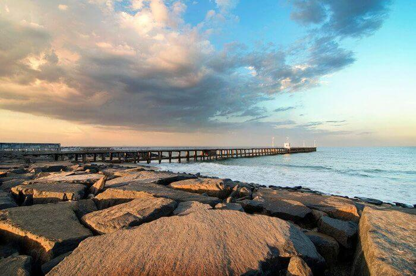
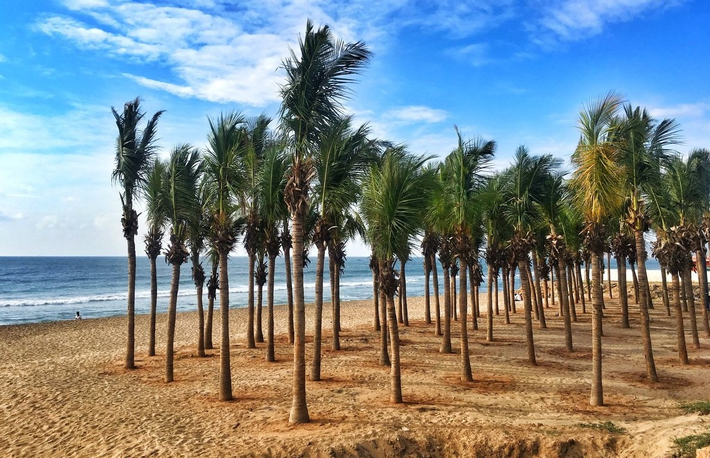
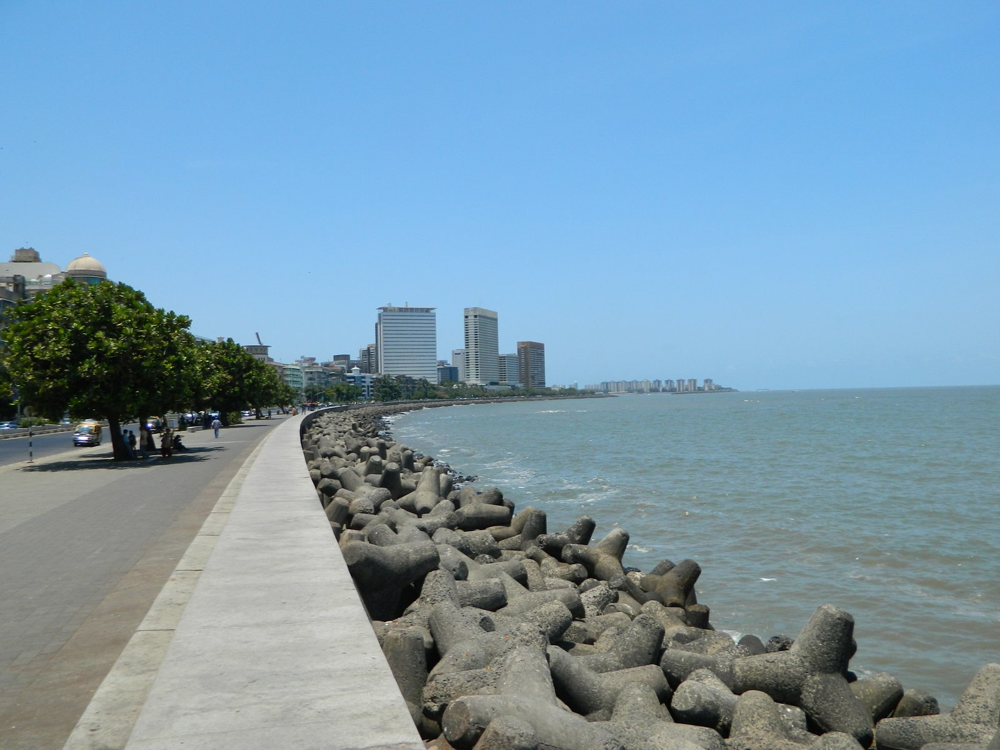

# assignment2-Gullapalli
This is my second repository to work on markdown.

# Sai Satyanarayana Gullapalli
###### My favourite food is alfredo penne chicken pasta.

I like this food because it is a mixture of both **veg and non veg** ingredients. It is prepared in a **high temperature** and with an extra added **mayonnaise**. This gives a good flavour to the dish.

----

## Preparation of penne alfredo chicken pasta :-
1. Cook the pasta, drain, and reserve cooking water.
1. Dry the chicken and season with salt and pepper.
1. Heat the oil over medium-high in a large frying pan.
1. Add the chicken to the hot pan, and cook for 5 to 7 minutes.
    1. Flip the chicken and cook for another 5 to 7 minutes, until the chicken reaches 165°F.
    2. Slice the chicken and cover to keep warm.
1. Slice the chicken and cover to keep warm.
1. Make the Alfredo sauce.
1. Add the drained pasta and toss to coat in the sauce.

### Ingredients :-
* Half cup chicken pieces
* Two table spoons butter
* Seasonings
    * Half spoon dried basil
    * Half spoon dried oregano
    * Half spoon pepper
* Half cup parmesan cheese
* Four cups penne pasta

[Click here to know about me](AboutMe.md)

----

## List of places that I would suggest to visit :-
1. Goa
1. Pondicherry
1. Vizag
1. Mumbai

I would like to suggest these places to visit because all these places were coastal regions and all the four places were different from each other. All the four places were the most popular tourism spots in India. Not only the Indians, many foreigners prefer visiting these places. 

|Location    | Number of hours that visitor should spend | Amount to be spent |
|  ----      |        ----                               |  ----              |
|Goa         |          150                              |  $ 200             |
|Pondicherry |          75                               |  $ 150             |
|Vizag       |          100                              |  $ 100             |
|Mumbai      |          50                               |  $ 250             |


 <br> Goa beach view


 <br> Pondicherry beach view


 <br> Vizag beach view


 <br> Mumbai beach view


----

## Quotes that I like :-

> "Be the change that you wish to see in the world." - Quote by _Mahatma Gandhi_ <br> 
> "Life should be great rather than long." - Quote by _Dr. B.R. Ambedkar_

----

## My language name is Z++ (Programming Language) :-

> Z++ simply called as zed plus plus, an object-oriented extension to the Z specification language.

Z++ allows for the definition of classes, and the relation of classes through inheritance, association, or aggregation. The primary construct of Z++ is a class. A Z++ class consists of a number of clauses which are optional.

Z++ Wikipedia <https://en.wikipedia.org/wiki/Z%2B%2B>

#### Below is the sample chunk of code of Z++ :-

``` Code (Java):
public static boolean containsBlock(Chunk chunk, Material block) {
    boolean foundOne = false;
    for(int y = 0; y <= 256; y++) {
        for(int x = 0; x <= 15; x++) {
            for(int z = 0; z <= 15; z++) {
                if(chunk.getBlock(x, y, z).getType() == block) {
                    if(foundOne)
                      return true;
                    else
                      foundOne = true;
                }
            }
        }
    }
    return false;
}
```
Z++ sample code reference <https://www.spigotmc.org/threads/detect-if-there-is-a-specific-block-a-chunk.432695/?__cf_chl_jschl_tk__=19f32464ea6e3efce154947189fe5a74dcaabfd4-1612243275-0-AW8YpCeinAk5QVjZ_0Goe1Zi2MgxW2Y1uo7ydFrtFTL1OtV_lV2WZVIdaZvHVWdvS4hE8U1iuAEfQ8dBBf5OrRZIq9jaaD9PJYBMN4_He9jMYPl-2dsfUuTW4jIOcPJYfmuaBH4ApIjmmt30pIvuCj1kezd8ZOQ6wdC1GnXi7W66nHHKZ1fpYSAan8Xnj3bfzSYkDH-K1VJu2x4G1d5ajKGqR2Klkhb7ubQcXgJo-FQ9tAymcvoNx_kRWHG85v3IiVGi0NGP-Nt1IR3zsAZ5ydZXejKH0ZZd7bYIuVGHhkK3P8o7PU2jPPYZPje8wCaen_1qGqDu7DkvvEj9vrK8vVcnF9SVcxuHASmWJH_ToN8IWorBHq_gqs5eVrzZop9F2Q>

